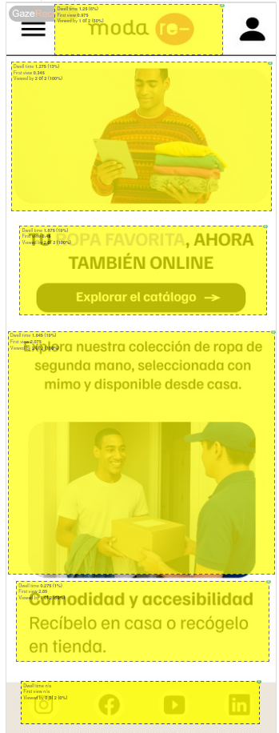

# Usability Report

#### Evaluación de usabilidad del proyecto 

### Catálogo online para Modare

### 18/05/2025

[Enlace a GITHUB del proyecto](https://github.com/DIU3-cristiancar/UX_CaseStudy)

### Realizado por:

Informe realizado por Equipo PalmeraFosforita. Hemos encontrado que el sitio web es bastante completo y es excelente visualmente pero hay problemas de navegación ya que varios botones del menu llevan al mismo sitio. No sabemos si es intencional o un error pero lo consideramos como algo negativo.

## 1 DESCRIPCIÓN DEL WEBSITE

Se trate de una app para una empresa de venta de ropa. La app permite ver el catalogo disponible en las tiendas de la empresa, ofrece información de contacto y sobre las tiendas y permite que los usuarios registrados compren y reserven los articulos disponibles en el sitio web.

 

## 2 RESUMEN EJECUTIVO

Este documento contiene una evalución de la usabilidad del proyecto centrada el prototipo de su aplicación movil y su landing page.

En cuanto a los problemas detectado lo unico realmente notable es que varios botones del menu llevan al mismo sitio lo cual afecta negativamente a la navigabilidad y puede confundir al usuario.

## 3 METODOLOGIA 

#### Metodología de usabililidad

Hemos pedido a los usuario que explorasen la pagina e intentaran acceder a la totalidad de las misma, tras esto les hemos suministrado un cuestionario SUS. tambien hemos hecho uso de tests de eye tracking.

#### Test de usuarios: Participantes

| Usuarios | Sexo/Edad     | Ocupación   |  Exp.TIC    | Personalidad | Plataforma
| ------------- | -------- | ----------- | ----------- | -----------  | ----------  
| Luis  | H / 25   | Estudiante     | Media        | Irritable    | móvil    
| Gabriel  | H / 21   | Estudiante  | Media       | Espontaneo     | móvil   

#### Resultados obtenidos

Los resultados del cuestionario SUS han sido los siguientes:

| Usuarios | Sexo/Edad     | Ocupación   |  Exp.TIC    | Personalidad | Plataforma | Puntuacion
| ------------- | -------- | ----------- | ----------- | -----------  | ---------- | ----------
| Luis  | H / 25   | Estudiante     | Media        | Irritable    | móvil      | 75
| Gabriel  | H / 21   | Estudiante  | Media       | Espontaneo     | móvil        | 85

Los resultados de eyetracking han sido los siguientes:

## 4 CONCLUSIONES 

Consideramos que el proyecto solo requiere retoques minimos antes de ser considerado viable para ser puesto en desarrollo y su posterior uso comercial.

#### Incidencias

No se han producido incidencias notables en relación con la evaluación de este proyecto.

#### Valoración 

* Landing page completa y funcional.
* Paleta de colores adecuada.
* Diseño claro y generalmente intuitivo para la navegación.
* Aspecto visual excelente.

#### Recomendaciones y propuesta de mejoras: 

* Es necesario que cada boton del menu lleve a una pagina distinta. 

#### Valoración de la prueba de usabilidad (self-assesment)

Creemos haber detectado las principales deficiencias y puntos fuertes haciendo uso de las tecnicas planteadas.
